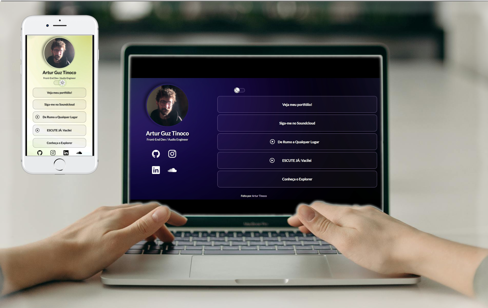

<h1 align="center"> Projeto ~ U-Link ~ </h1>

Projeto final do curso Discover promovido pela plataforma <a href="https://app.rocketseat.com.br/">Rocketseat</a>.

  <a href="#-tecnologias">Tecnologias Utilizadas</a>&nbsp;&nbsp;&nbsp;|&nbsp;&nbsp;&nbsp;
  <a href="#-projeto">Conceito do Projeto</a>&nbsp;&nbsp;&nbsp;|&nbsp;&nbsp;&nbsp;
  <a href="#memo-licença">Licença</a>

  

 

  

## 🤖 Tecnologias Utilizadas

O U-Link foi desenvolvido com as seguintes tecnologias:

   HTML5 
    CSS3
- JavaScript
- Git e Github
- Figma

## 💻 Projeto

O DevLinks é um agregador de links para usar como cartão de visitas online.

## 🔖 Layout

Você pode visualizar o layout do projeto através [DESSe LINK](https://www.figma.com/design/yNnxyTi3N8SLN3xSq0gcNS/DevLinks-%E2%80%A2-Projeto-Discover-(Community)?node-id=1437-191&t=C5E9oSjSI9BOfiXl-0). É necessário ter uma conta no [Figma](https://figma.com) para acessá-lo.

## :memo: Licença

Esse projeto está sob a licença MIT.

---

Feito com ♥ by Rocketseat :wave: [Participe da nossa comunidade!](https://discord.gg/rocketseat)
